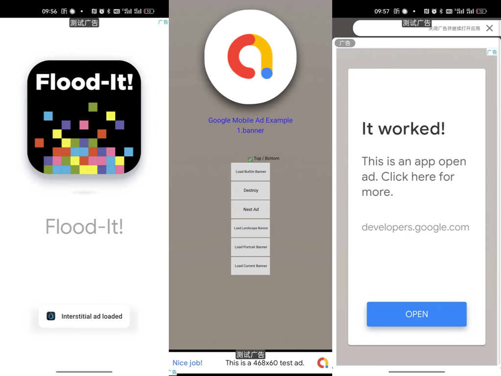

# Cocos Creator Google Admob Extension

本插件是为了方便用户快速使用 Cocos Creator 接入谷歌 Admob 平台而设计。

This extension is designed for Cocos Creator users to integrate the Google Ad Mobile SDK.

中文版请查看 [文档](./extensions/GoogleAdMob/doc/zh/index.md)。

For the English version please refer to [Document](./extensions/GoogleAdMob/doc/en/index.md)。

## 支持的广告类型/Supported Advertisement Types

- Banner
- Interstitial
- AppOpenAd
- Rewarded
- RewardedInterstitial
- Native

