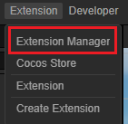
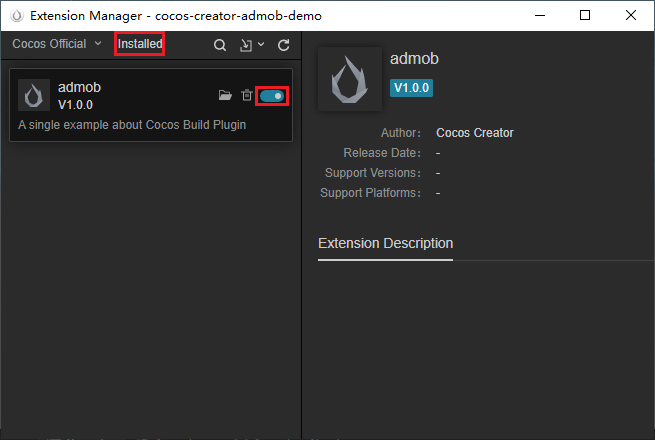
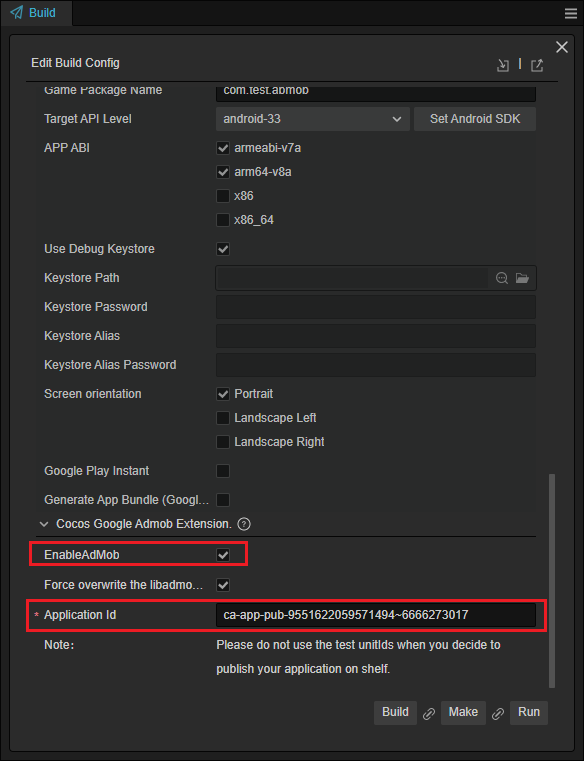

# Cocos Creator Google Mobile Advertisement Extension

This extension is designed for Cocos Creator to integrate the Google Mobile Ad SDK.

如果你需要中文文档，请移步 [CN](./README_en.md)。

## API 使用说明

TODO:

## Work Flow

- Download this sample
- Open the project by Cocos Creator v3.7.3.
- Open the Extension Manager panel.

    

- Enable this extension in the installed page

    

- Create an Android Build Task

    

- Input your application Id, and check the **EnableAdmob** option
  
    

- Click on the Build button, and then open the Android project by AndroidStudio, then build the apk to test.

    